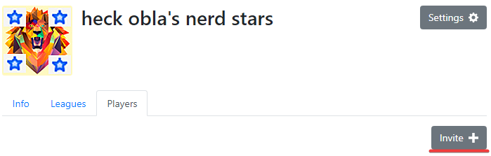

## About

As per [ozfortress seasonal league’s transfer rules](https://ozfortress.com/rules#26-transfers), teams may apply to have transfers of players onto their rosters throughout the season. Captains may apply for a player’s transfer at *any time*, however, be aware of the eligibility and team limit restrictions.

## Sixes (6v6) Transfers
Sixes Transfers are moderated via a fortnightly Transfer Window system for regular seasonal competitions, more information can be found at the bottom of the current seasonal league page. For applicants to be eligible to play in a particular round, the transfer application must be submitted by **11:59 PM AEST/AEDT time on the Thursday of the previous transfer window**. Players whose applications were submitted after the cutoff may still play as a mercenary, however, all normal mercenary rules apply and therefore they may not be used if they have played as a mercenary in a previous round or are denied by the other team. Administrators will have decisions before the start of the next round.

## Highlander (9v9) Transfers
Highlander Transfers are moderated via a weekly Transfer Window system for regular seasonal competitions, more information can be found at the bottom of the current seasonal league page. For applicants to be eligible to play in a particular round, the transfer application must be submitted by **11:59 PM AEST/AEDT time on the Friday of the previous transfer window**. Players whose applications were submitted after the cutoff may still play as a mercenary, however, all normal mercenary rules apply and therefore they may not be used if they have played as a mercenary in a previous round or are denied by the other team. Administrators will have decisions before the start of the next round.

## Reviewing Transfer Requests & Roster Lock
When approving transfers, division administrators take into account the skill of the requested player, the skill of the team and the skill of the overall division. Because of this, transfers are often denied on the basis of the requested player being too skilled for their team or division. Please keep this in mind when requesting transfers as no transfers are ever guaranteed. Make sure your team is prepared in the event of a transfer being denied.

**The last week for transfers is Week 6**. Rosters are locked after that week for Week 7 and playoffs. Transfers will be approved by administrators no later than Saturday at 11:59 PM.

*Teams are reminded that transfers are not guaranteed. If issues come up that may impact team stability you must contact your division administrator as soon as possible.*

*Players being transferred should have their profile public along with their game info (TF2 hours, achievements, etc). Failure to do so may result in your transfer request being denied.*

## How to request a player transfer as Team Captain
1. Click on ‘Invite’ on your roster. Search for the player you wish to invite and click the blue ‘Invite’ button. Have the specified player accept the invitation. If the ‘Invite’ button is greyed out, the player has already been invited. NOTE that this is not a transfer and does not mean the player will be transferred.

2. Click on ‘Manage’ to the right of the roster you signed up and are playing with.

3. Scroll down to ‘Players off Roster’ and press ‘Add’ to send a transfer request to administrators.

4. Wait until the next transfer window for your transfer to be processed.
